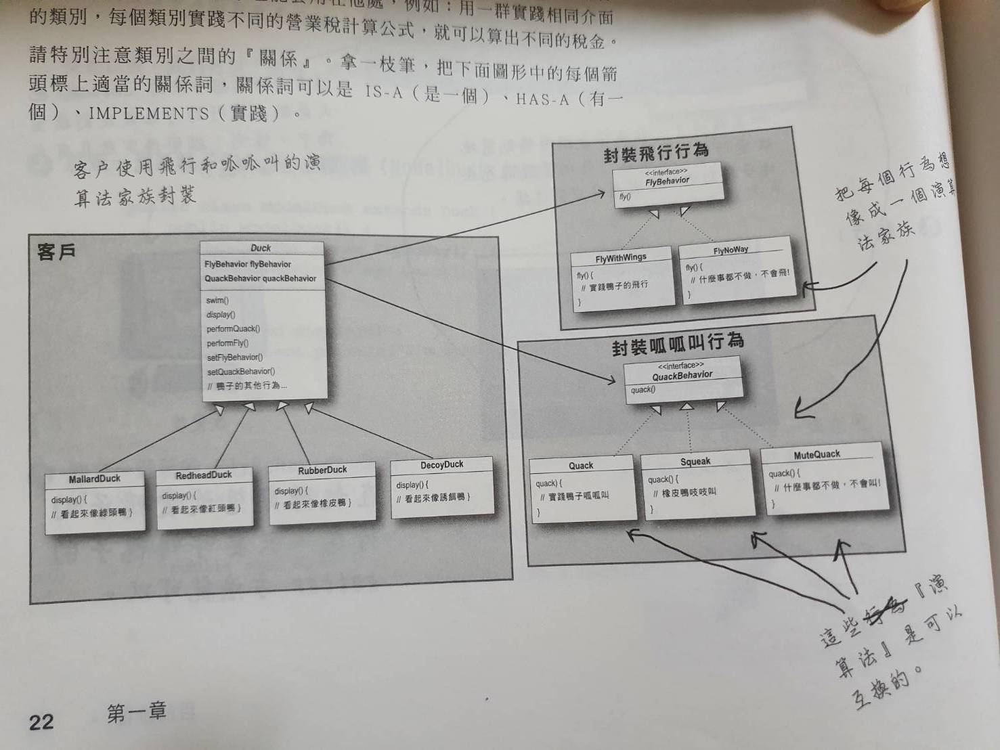

# 策略模式 (Strategy Pattern)
- 原則：利用多型 (Polymorphism) 並以實踐介面 (Interface) 的方式來設計程式，這樣可以保持系統變動時候的彈性；將可以互換的行為封裝起來。
- 實作：將程式碼抽取成介面，並以實作介面的方式開發；執行期的型別以介面為型別，發揮多型的效用。

## 說明

​        在學習物件導向之後，心理有一種認定就是介面優於繼承，因此看到情境使用繼承該如何寫得更容易擴充、維護時，直覺就是改用介面來替代。然而卻忽略了繼承其實是具有程式碼重用的優點，如果改為介面，重複的程式碼反而會一再出現。

​        發現這點的時候其實挺震驚的，那到底該怎麼辦，才能兼具兩者的優點？而答案就是策略模式，這個模式同時也刷新了我對封裝的認知，能夠封裝的不只是具現的事物，抽象的行為（或者說是演算邏輯）也可以做為封裝。

​        範例是以實作各式鴨子為範例，一開始使用繼承很容易讓衍生類別多了不相干的方法；但使用介面又會出現重複程式碼的問題。

## class diagram

## 小結

#### 將變動的部分封裝起來

- 思考什麼是會變動的？
- 思考什麼是可以封裝的？

#### 多用合成，少用繼承

- 降低耦合
- 根據策略模式的精神，演算邏輯由合成的類別實作

#### 針對介面撰寫，而非針對實踐方式撰寫。

- 避免讓演算邏輯跟著衍生類別
- 讓演算邏輯獨立成為物件，並且能夠經由合成的方式共用(宣告類別時，不必理會執行時期真正的物件)

